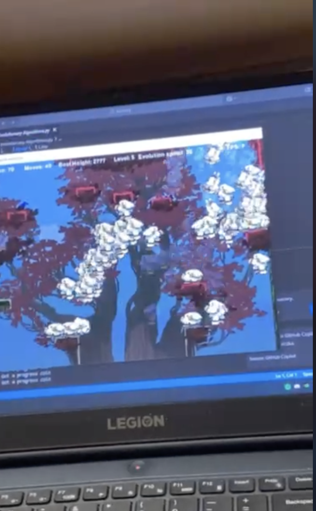

# Sprawozdanie z projektu AI do gry Jump King

**Data:** 31.05.2025  
**Środowisko:** Windows/macOS + VSCode + Pipenv  
**Technologie:** Python 3.10+, Pygame, NumPy

---

# Kamień 1: Dokumentacja Wymagań AI dla Jump Kinga

## 1.1. Cele Projektu
- **Główny cel:** Stworzenie modelu AI, który autonomicznie pokonuje grę *Jump King*.
- **Szczegółowe cele:**
  - Integracja procesu podejmowania decyzji z silnikiem gry w czasie rzeczywistym.
  - Stworzenie i testowanie środowiska treningowego pod algorytm DQN.
  - Zaprojektowanie funkcji nagrody oraz logiki oceny postępów.
  - Analiza i ewaluacja działania modelu.
  - Refaktoryzacja w kierunku wydajnej i przewidywalnej AI opartej na heurystyce.

## 1.2. Zakres Wymagań
- **Funkcjonalne:**
  - Integracja AI z klasami `Game`, `King`, `Level` w kodzie gry.
  - Możliwość sterowania postacią poprzez logikę AI.
  - Obsługa danych wejściowych reprezentujących stan gry.
  - Decyzje oparte na danych w czasie rzeczywistym.
- **Niefunkcjonalne:**
  - Niska latencja — działanie płynne i responsywne.
  - Stabilność działania nawet w przypadku nieprzewidywalnych błędów silnika gry.
  - Możliwość uruchomienia zarówno na Windows, jak i macOS.

## 1.3. Wymagane Zasoby
- **Język programowania:** Python 3.10+
- **Środowisko IDE:** Visual Studio Code
- **Biblioteki:**
  - `pygame` – silnik gry
  - `tensorflow` – implementacja DQN
  - `numpy` – obliczenia
  - `collections`, `random`, `os` – kontrola logiki AI
- **Zarządzanie środowiskiem:** pipenv

## 1.4. Określenie Problemu
- **Opis:** Gra *Jump King* wymaga precyzyjnych skoków, a pomyłki są kosztowne — często prowadzą do znacznego cofnięcia postępu.
- **Wyzwania:**
  - Opracowanie algorytmu, który potrafi poradzić sobie z fizyką gry.
  - Skuteczna implementacja strategii i decyzji przy dużej liczbie warunków brzegowych.
  - Poradzenie sobie z błędami i bugami w zewnętrznym silniku gry (klon z GitHuba).

---

# Kamień 2: Zbiór Danych i Integracja ze Środowiskiem Gry

## 2.1. Gra jako Źródło Danych
Do celów projektu wykorzystano zmodyfikowany klon gry *Jump King* napisany w Pythonie z użyciem Pygame. Integracja AI z grą polegała na bezpośrednim odczycie właściwości obiektów:

- Pozycja gracza (`x`, `y`)
- Prędkość, kąt skoku, stan (`isFalling`, `isCrouch`, `isSplat`)
- Informacja o poziomie (`current_level`)
- Różnica wysokości względem początku epizodu

## 2.2. Reprezentacja Stanu i Danych
W wersji DQN stan gry reprezentowano jako wektor 8 liczb:
1. Normalizowana pozycja `x`
2. Normalizowana pozycja `y`
3. Prędkość skoku (0–1)
4. Kąt skoku
5. Czy na ziemi
6. Czy gracz kuca
7. Różnica pozycji względem poprzedniego kroku
8. Poziom gry

Zbierane dane były zapisywane w buforze doświadczeń (`replay buffer`) o długości 10 000. Dodatkowo zastosowano funkcję nagrody premiującą wzrost wysokości, a karzącą spadki, kolizje i utratę poziomu.

## 2.3. Problemy z Danymi
- Poziomy były resetowane przez silnik gry bez zachowania spójnych współrzędnych.
- Brak spójnych zdarzeń typu „awans” / „porażka” — utrudniało przypisanie nagrody.
- Niska powtarzalność rozgrywki prowadziła do problemów z uogólnieniem danych w DQN.

---

# Kamień 3: Od DQN do pierwszej wersji heurystyki

## 3.1. Próba implementacji DQN

### Główne cechy DQN:
- **Wejście:** 8-wymiarowy wektor cech stanu (pozycja, prędkość, kąt, poziom, kolizje, itp.)
- **Wyjście:** 6 dyskretnych akcji – skoki lewo/prawo z różną mocą (słaby/średni/mocny)
- **Bufor pamięci:** 10 000 doświadczeń `(s, a, r, s', done)`
- **Sieć neuronowa:** 2 warstwy Dense (32 neurony), aktywacja ReLU, optymalizator Adam
- **Eksploracja:** ε-greedy z dekrementacją ε = 0.995

### Wyniki:
- Trening prowadzono w sumie przez ponad 50h na dwóch urzadzeniach.
- Model nie wykazywał wyraźnej poprawy – potrafił maksymalnie awansować o jeden poziom.
- Uczenie było chaotyczne – brak stabilnych trajektorii i powtarzalnych sukcesów.
- AI często wykonywała losowe skoki lub pozostawała w miejscu.
- Dynamiczne, nieregularne środowisko gry (zwłaszcza kolizje i fizyka) nie sprzyjało skutecznemu uczeniu.

Zdecydowano o porzuceniu DQN na rzecz bardziej kontrolowanego podejścia.

---

## 3.2. Przejście na pierwszą wersję algorytmu heurystycznego

Po rezygnacji z DQN, rozpoczęto prace nad pierwszą wersją **deterministycznego algorytmu heurystycznego**. Celem było ręczne zaprogramowanie reguł decyzyjnych, bazujących na prostych warunkach logicznych.

### Założenia:
- AI monitorowała pozycję postaci i sprawdzała, czy znajduje się w wyznaczonej „strefie skoku”.
- Jeśli warunek był spełniony, wykonywano przypisany do niej skok.
- Próbowano nadal obsługiwać **przechodzenie między poziomami**, co komplikowało logikę.
- Po zmianie poziomu gra resetowała współrzędne gracza, przez co AI często traciła kontekst, myląc np. awans z upadkiem.
- AI nie radziła sobie z bardziej złożonymi scenariuszami — skakała w miejscu lub wykonywała puste akcje.

### Problemy:
- Brak wall bounce, co ograniczało strategię ruchu.
- Kod miał ponad 700 linii — bardzo trudny w utrzymaniu.
- Mnogość warunków specjalnych prowadziła do błędów i zablokowań.
- Działanie było niestabilne i nieprzewidywalne.

---

# Kamień 4: Optymalizacja heurystyki i stabilna wersja AI

## 4.1. Kluczowe zmiany
- **Rezygnacja z poziomów:** model działa tylko na jednym poziomie, eliminując problemy z resetem pozycji.
- **Wall bounce:** dodano mechanikę odbijania się od ścian — AI zyskała nową strategię przechodzenia poziomu.
- **Precyzyjna kontrola:** ustalono konkretne warunki wykonania skoku zależne od pozycji gracza.
- **Redukcja kodu:** z 700 do ~300 linijek, modularność i lepsza czytelność.

## 4.2. Efekty
- AI działa deterministycznie i powtarzalnie.
- Jest w stanie stabilnie przechodzić poziom, reagować na zmiany i radzić sobie z bardziej złożonymi układami platform.
- Model można rozwijać dalej — np. przywrócenie poziomów, wprowadzenie zmiennych warunków środowiskowych itp.

## 4.3 Struktura algorytmu
W finalnej wersji projektu zastosowano **adaptacyjny algorytm heurystyczny** realizujący skoki na podstawie symulowanej trajektorii oraz prostego systemu planowania. AI nie korzysta z uczenia maszynowego — jej działanie opiera się na obliczeniach fizycznych i analizie kolizji z platformami w czasie rzeczywistym.

## Struktura algorytmu

Algorytm składa się z trzech głównych komponentów:

### 1. `JumpPhysicsCalculator`
Moduł odpowiedzialny za:
- symulację trajektorii skoku (uwzględnia grawitację, prędkość i kąt skoku),
- dodawanie wektorów ruchu: siły skoku + siła grawitacji,
- wykrywanie kolizji trajektorii z platformami lub ścianami (obsługa wall bounce),
- detekcję rodzaju kolizji: lądowanie, odbicie od ściany, przeszkoda.

### 2. `SmartJumpPlanner`
Moduł planujący skoki:
- generuje wiele trajektorii skoków w lewo/prawo dla różnych czasów ładowania (charge),
- każdą trajektorię sprawdza pod kątem kolizji z platformami,
- oblicza **score** dla każdego możliwego skoku (na podstawie odległości poziomej oraz względnej wysokości),
- sortuje i wybiera najlepszą trajektorię,
- uwzględnia możliwość skoku z odbiciem od ściany (`bounce`).

### 3. `AdaptiveJumpKingAI`
Główna logika AI:
- działa w cyklach planowania → ładowania → wykonania skoku,
- planuje tylko gdy gracz jest na ziemi (`lastCollision`),
- ładuje skok przez `jumpCount` do ustalonej wartości,
- wykonuje skok w lewo lub prawo zależnie od wybranego planu,
- po wykonaniu skoku czeka na ponowne zetknięcie z platformą i planuje kolejny.

---

## Przykładowy cykl działania AI

1. **AI wykrywa, że gracz stoi na platformie.**
2. **Planner generuje trajektorie** i wybiera najlepszy skok w prawo (np. `charge=23`).
3. **AI wchodzi w tryb „crouch”**, zwiększając `jumpCount` z każdą klatką.
4. Gdy `jumpCount` ≥ `target_charge`, **AI wykonuje skok** w zaplanowanym kierunku.
5. **Po skoku** AI czeka na ponowny kontakt z podłożem (`lastCollision != None`), aby powtórzyć proces.

---

## Zalety podejścia

- **Deterministyczne i przewidywalne:** brak eksploracji, pełna kontrola nad trajektorią.
- **Realna analiza fizyki:** symulacja wewnętrzna pozwala ocenić skuteczność skoku przed jego wykonaniem.
- **Obsługa wall bounce:** AI może świadomie wykonać skok z odbiciem od ściany.
- **Możliwość rozbudowy:** np. dodanie pamięci trajektorii, bardziej złożone strategie (podwójny bounce, skoki w pionie itd.).

---

## Ograniczenia

- AI działa wyłącznie **w poziomie** (skoki w lewo/prawo); nie obsługuje celowego skakania pionowego.
- Planner przeszukuje jedynie ograniczoną przestrzeń możliwych skoków (4 zakresy ładowania x 2 kierunki).
- Nie uwzględnia trajektorii z uwagi na przyszłe poziomy ani nie przewiduje długoterminowych sekwencji.

## 4.4. Wnioski
To właśnie na tym etapie AI osiągnęła funkcjonalność odpowiadającą celowi projektu. Kod jest stabilny, a model radzi sobie w trudnych warunkach bez potrzeby stosowania uczenia maszynowego.

---
